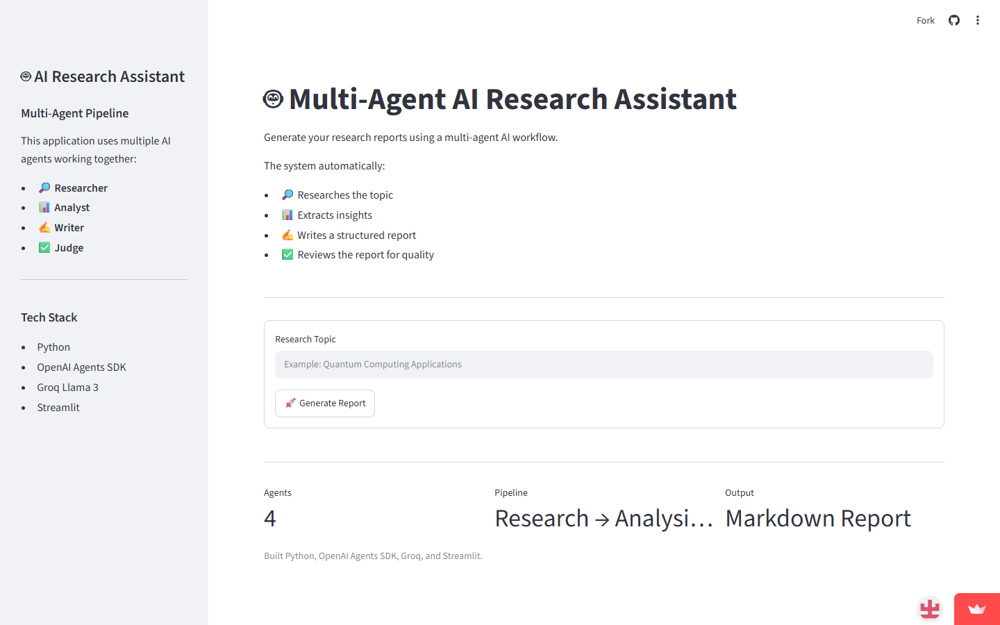
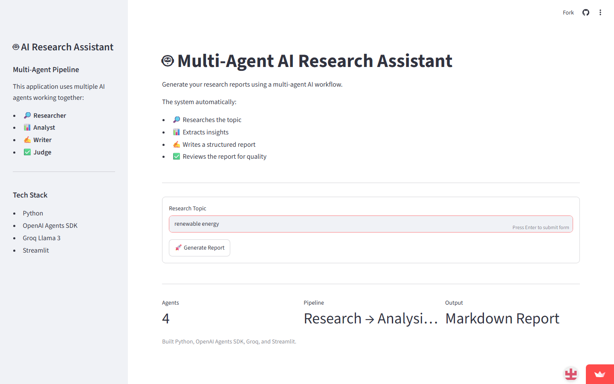
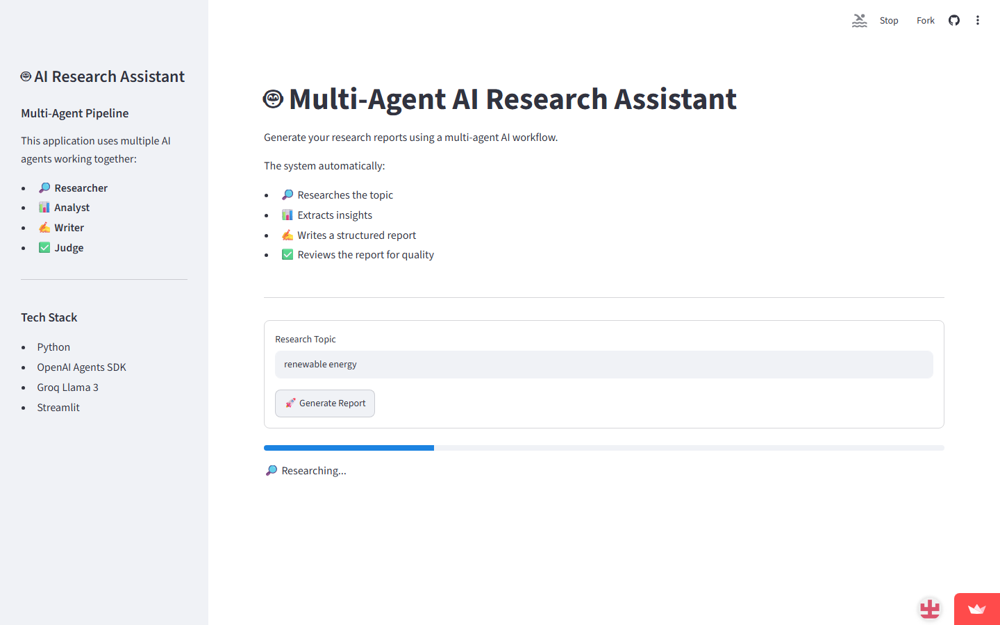
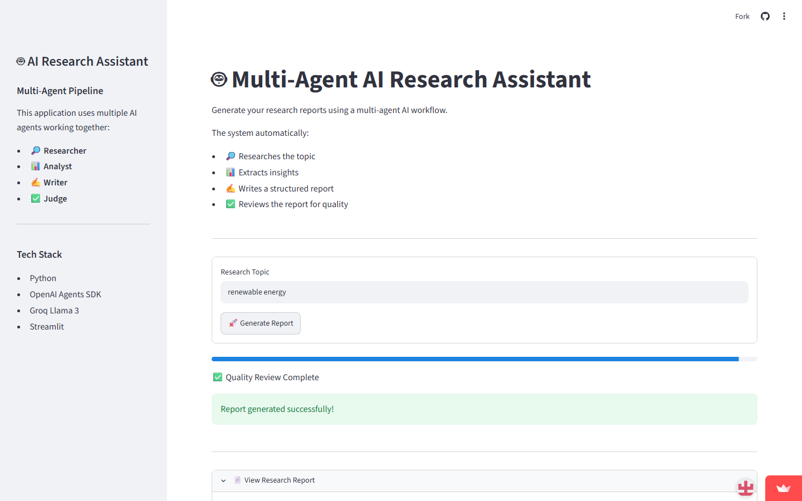
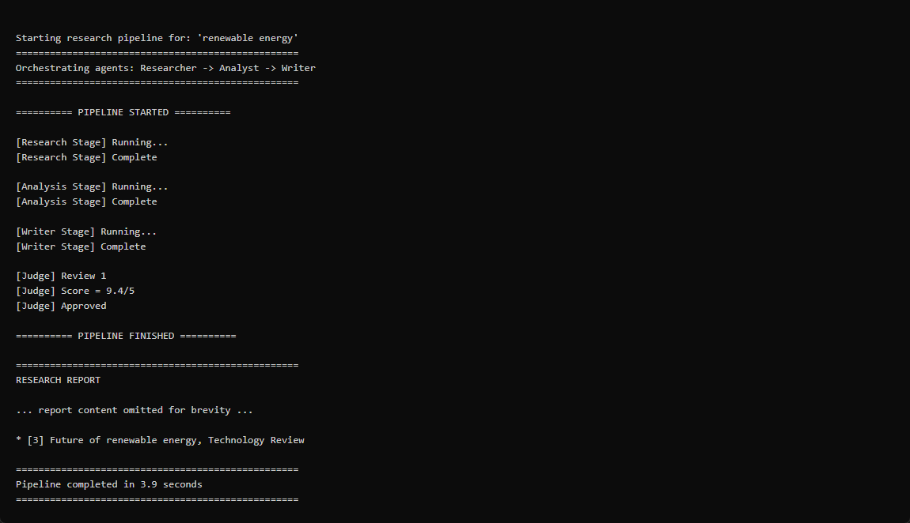

<p align="center">
  
  
  
  
  
</p>

# Multi-Agent Research Pipeline

> An AI-powered research pipeline that orchestrates four specialized agents to automatically generate high-quality, peer-reviewed research reports on any topic — backed by **real web search** and built with the **OpenAI Agents SDK** and **Groq**.

**Live Demo:** [multi-agentresearch-byabhinandpv.streamlit.app](https://multi-agentresearch-byabhinandpv.streamlit.app/)

---

## What's New

| Change | Details |
|---|---|
| 🔍 **Real web search** | Replaced mock stub with **DuckDuckGo Search** — no API key required |
| 📊 **Live progress** | Streamlit UI now shows per-stage progress in real time |
| 🧠 **Configurable model** | Switch Groq models via `GROQ_MODEL` env var without touching code |
| 🌡️ **Temperature control** | Each agent uses a tuned temperature for its role (0.1–0.5) |
| 📚 **Session history** | Previously generated reports are preserved in the sidebar |
| 🛡️ **Reliability fixes** | Judge score fallback, narrower false-positive detection, graceful revision cap |
| 📝 **Logging** | Replaced `print()` statements with structured Python `logging` |
| 🏷️ **Type hints** | Full type annotations on all public functions |

---

## Key Features

- **Four Specialized Agents** — Each agent has a distinct role: research, analysis, writing, and quality review.
- **Real Web Search** — The Researcher agent performs multi-query DuckDuckGo searches, deduplicates results, and extracts up to 12 real sources per report.
- **Automated Quality Loop** — A Judge agent scores reports on 6 criteria and triggers targeted revisions until the quality threshold is met.
- **Live Pipeline Progress** — The Streamlit UI updates in real time as each stage completes.
- **Session Report History** — Past reports are stored in the session and accessible from the sidebar without re-running.
- **Configurable Model** — Switch between Groq's fast and high-quality models via an environment variable.
- **Retry & Error Handling** — Built-in exponential-backoff retry logic for API rate limits and transient failures.
- **Output Validation** — Every stage validates its output for API errors and pipeline failures using precise keyword matching.

---

## Screenshots & Demo

Try the deployed app: **[https://multi-agentresearch-byabhinandpv.streamlit.app/](https://multi-agentresearch-byabhinandpv.streamlit.app/)**

### Streamlit Web UI

| Home | Topic entered |
|:---:|:---:|
|  |  |

| Pipeline running | Generated report |
|:---:|:---:|
|  |  |

### Command Line Interface

**Setup verification** (`python test_setup.py`):


**Full pipeline** (`python main.py "renewable energy"`):



---

## Architecture

```
                        ┌──────────────┐
                        │  User Input  │
                        │   (Topic)    │
                        └──────┬───────┘
                               │
                        ┌──────▼───────┐
                        │ Orchestrator │
                        └──────┬───────┘
                               │
              ┌────────────────┼────────────────┐
              │                │                │
       ┌──────▼──────┐ ┌──────▼──────┐ ┌───────▼──────┐
       │  Researcher  │ │   Analyst   │ │    Writer    │
       │  DuckDuckGo  │─▶  Insights  │─▶   Report    │
       │  (Stage 1)   │ │  (Stage 2)  │ │  (Stage 3)   │
       └──────────────┘ └─────────────┘ └───────┬──────┘
                                                │
                                         ┌──────▼──────┐
                                         │    Judge    │
                                         │  (Stage 4)  │
                                         └──────┬──────┘
                                                │
                                    ┌───────────┴───────────┐
                                    │                       │
                              Score ≥ 4.0             Score < 4.0
                                    │                       │
                             ┌──────▼──────┐    ┌───────────▼──────────┐
                             │   Approved  │    │  Revision Required   │
                             │   Report    │    │  (Back to Writer)    │
                             └─────────────┘    └──────────────────────┘
                                                (up to 2 revision cycles)
```

---

## Agent Details

| Agent | Role | Responsibilities |
|---|---|---|
| **Researcher** | Information Gathering | Runs 3 targeted DuckDuckGo queries, deduplicates by URL, returns up to 12 real sources |
| **Analyst** | Insight Extraction | Identifies key findings, trends, opportunities, risks, and gaps from the research |
| **Writer** | Report Composition | Converts research and analysis into a structured, professional Markdown report |
| **Judge** | Quality Assurance | Scores the report on 6 criteria (1–5 scale), triggers revisions if average < 4.0 |

### Agent Temperature Settings

Each agent uses a temperature tuned for its role:

| Agent | Temperature | Rationale |
|---|---|---|
| Researcher | `0.2` | Low — factual extraction, must be precise |
| Analyst | `0.2` | Low — analytical consistency, avoid invention |
| Writer | `0.5` | Medium — quality prose while staying grounded |
| Judge | `0.1` | Very low — reproducible, consistent scoring |

### Judge Evaluation Criteria

The Judge agent scores each report on the following dimensions:

| Criterion | What It Measures |
|---|---|
| **Relevance** | Does the report directly answer the requested topic? |
| **Completeness** | Are all important aspects covered without obvious gaps? |
| **Accuracy** | Is the content consistent with the provided research? |
| **Clarity** | Is the report easy to understand with precise language? |
| **Organization** | Is the structure logical and headings used effectively? |
| **Professionalism** | Would this be acceptable in a professional/academic setting? |

Reports scoring **≥ 4.0 average** are approved. Otherwise, the Writer receives targeted feedback and revises (up to **2 revision cycles**). After exhausting revisions, the best available report is returned.

---

## Project Structure

```
multi-agent_research_pipeline/
├── app.py                           # Streamlit web UI (deploy entry point)
├── main.py                          # CLI entry point — accepts topic & runs pipeline
├── requirements.txt                 # Python dependencies
├── .env.example                     # Environment variable template
├── .streamlit/
│   ├── config.toml                  # Streamlit theme and server settings
│   └── secrets.toml.example         # Secrets template for Streamlit Cloud
├── .gitignore                       # Git ignore rules
├── test_setup.py                    # Quick test to verify Groq connectivity
├── docs/
│   └── screenshots/                 # README screenshots (Streamlit + CLI)
├── scripts/
│   ├── capture_screenshots.py       # Capture live app screenshots
│   └── render_cli_screenshots.py    # Render CLI output for README
│
└── custom_agents/                   # Agent definitions
    ├── __init__.py
    ├── config.py                    # Groq model configuration (supports GROQ_MODEL env var)
    ├── orchestrator.py              # Pipeline orchestration, retry logic, progress callbacks
    ├── researcher.py                # Researcher agent + DuckDuckGo search tool
    ├── analyst.py                   # Analyst agent
    ├── writer.py                    # Writer agent
    └── judge.py                     # Judge agent (quality reviewer)
```

---

## Getting Started

### Prerequisites & Required Tools

1. **Git** — version control and cloning.
2. **Python 3.10+** — runtime environment.
3. **pip** — package installer.
4. **venv** — recommended to isolate project dependencies.
5. **Groq API Account & Key** — free at [console.groq.com](https://console.groq.com).
6. **DuckDuckGo Search** — no API key needed; installed as a Python package.

### Installation

```bash
# 1. Clone the repository
git clone https://github.com/Abhinand-PV/multi-agent_research_pipeline.git
cd multi-agent_research_pipeline

# 2. Create and activate a virtual environment
python -m venv venv
source venv/bin/activate        # Linux / macOS
# OR
venv\Scripts\activate           # Windows

# 3. Install dependencies
pip install -r requirements.txt

# 4. Configure environment variables
cp .env.example .env
# Open .env and add your GROQ_API_KEY
```

### Configuration

Create a `.env` file in the project root:

```env
# Required
GROQ_API_KEY=your_groq_api_key_here

# Optional — switch model without changing code
# llama-3.1-8b-instant     (default — fast)
# llama-3.3-70b-versatile  (best quality)
GROQ_MODEL=llama-3.1-8b-instant

# Recommended — disable SDK tracing
OPENAI_AGENTS_DISABLE_TRACING=1
```

---

## Usage

### Web UI (Streamlit)

```bash
streamlit run app.py
```

The UI will show:
- Live per-stage progress updates as the pipeline runs
- The full report rendered as Markdown
- A download button for the `.md` file
- Past reports in the sidebar (persisted for the session)

### Command Line Interface

```bash
python main.py "artificial intelligence in healthcare"
```

The CLI prints percentage-based progress as each stage completes:

```
[ 10%] 🔎 Stage 1/4 — Researching topic...
[ 20%] ⚙️  [Research Stage] Running (attempt 1)...
[ 35%] 📊 Stage 2/4 — Analysing findings...
[ 60%] ✍️  Stage 3/4 — Writing report...
[ 80%] ✅ Stage 4/4 — Judge reviewing report...
[ 95%] ✅ Report approved by Judge (score: 4.33/5.0)
```

### Verify setup

```bash
python test_setup.py
```

---

## Streamlit Cloud Deployment

This project is ready to deploy on [Streamlit Community Cloud](https://share.streamlit.io).

### 1. Push to GitHub

Ensure your repository includes `app.py`, `requirements.txt`, and config files.

### 2. Create the app on Streamlit Cloud

1. Sign in at [share.streamlit.io](https://share.streamlit.io)
2. Click **Create app**
3. Select your GitHub repository and branch
4. Set **Main file path** to `app.py`
5. Click **Deploy**

### 3. Add secrets

In your app's **Settings → Secrets**, add:

```toml
GROQ_API_KEY = "your_groq_api_key_here"
GROQ_MODEL = "llama-3.1-8b-instant"
OPENAI_AGENTS_DISABLE_TRACING = "1"
```

### 4. Redeploy

After changing secrets or code, redeploy from the Streamlit Cloud dashboard.

---

## Configuration Options

The pipeline behaviour can be tuned via constants in [`orchestrator.py`](custom_agents/orchestrator.py) and environment variables:

### Code Constants

| Parameter | Default | Description |
|---|---|---|
| `MAX_RETRIES` | `3` | Maximum retry attempts per agent on transient errors |
| `MAX_REVISIONS` | `2` | Maximum revision cycles for the Writer based on Judge feedback |
| `QUALITY_THRESHOLD` | `4.0` | Minimum average score (out of 5) required for the Judge to approve |

### Environment Variables

| Variable | Default | Description |
|---|---|---|
| `GROQ_API_KEY` | *(required)* | Your Groq API key |
| `GROQ_MODEL` | `llama-3.1-8b-instant` | Groq model to use for all agents |
| `OPENAI_AGENTS_DISABLE_TRACING` | `1` | Disable OpenAI Agents SDK telemetry |

---

## Tech Stack

| Technology | Version | Purpose |
|---|---|---|
| [OpenAI Agents SDK](https://github.com/openai/openai-agents-python) | `0.17.7` | Agent orchestration framework |
| [Groq API](https://groq.com) | — | Ultra-fast LLaMA inference |
| [DuckDuckGo Search](https://pypi.org/project/duckduckgo-search/) | `≥6.2.0` | Real web search (no API key required) |
| [python-dotenv](https://pypi.org/project/python-dotenv/) | `1.1.0` | Environment variable management |
| [Streamlit](https://streamlit.io) | `≥1.32.0` | Web UI and cloud deployment |
| Python | `3.10+` | Runtime |

---

## Roadmap

- [x] Add a web-based UI for interactive use
- [x] Real web search (DuckDuckGo — no API key required)
- [x] Live pipeline progress in the Streamlit UI
- [x] Configurable model via environment variable
- [x] Session report history
- [x] Per-agent temperature tuning
- [ ] Integrate a premium search provider (Tavily, SerpAPI, Brave Search)
- [ ] Add support for multiple LLM providers (OpenAI, Anthropic, Gemini)
- [ ] Export reports to PDF / HTML
- [ ] Implement persistent report storage (database)
- [ ] Add citation verification and fact-checking

---

## Contributing

Contributions are welcome! Please feel free to submit a Pull Request.

1. Fork the repository
2. Create your feature branch (`git checkout -b feature/amazing-feature`)
3. Commit your changes (`git commit -m 'feat: add amazing feature'`)
4. Push to the branch (`git push origin feature/amazing-feature`)
5. Open a Pull Request

---

## License

This project is licensed under the **MIT License** — see the [LICENSE](LICENSE) file for details.

---

<p align="center">
  Built using the OpenAI Agents SDK · Groq · DuckDuckGo Search · Streamlit
</p>
